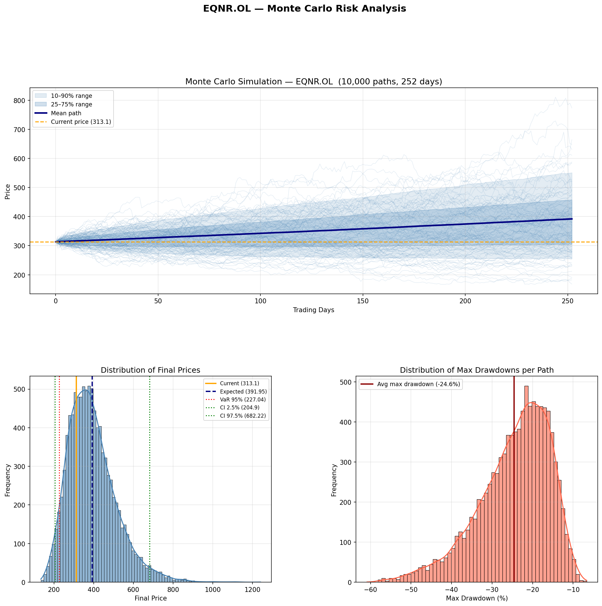

# Monte Carlo Stock Risk Simulator

A quantitative finance project that simulates possible future stock price paths using **Monte Carlo simulation with fat-tailed distributions**.

The model analyzes risk, volatility, drawdowns, and price probabilities using historical market data from Yahoo Finance.

The simulation produces a comprehensive visualization showing:

- simulated price paths
- probabilistic price ranges
- distribution of final prices
- distribution of maximum drawdowns

---

## Example Output

The script automatically generates the following analysis plot:

The visualization contains:

1. **Monte Carlo Price Paths**
   - 10,000 simulated price paths
   - Mean expected path
   - 10–90% and 25–75% confidence bands

2. **Final Price Distribution**
   - Probability distribution of simulated final prices
   - Expected value
   - Value-at-Risk (VaR)
   - Confidence interval

3. **Drawdown Distribution**
   - Maximum drawdown experienced in each simulated path

---

## Features

### Quantitative Model
- **Geometric Brownian Motion**
- **Fat-tailed t-distribution shocks** (better modeling of market crashes)
- Vectorized simulations for high performance

### Risk Metrics
The model calculates:

- Expected future price
- Probability of price increase/decrease
- Log-return volatility
- **95% Confidence Interval**
- **Value-at-Risk (VaR)**
- **Conditional Value-at-Risk (CVaR / Expected Shortfall)**
- **Average Maximum Drawdown**
- **Sharpe Ratio**
- **Sortino Ratio**

### Performance
- 10,000 simulations
- 252 trading days (1 year forecast)
- Fully vectorized using NumPy for speed

---
